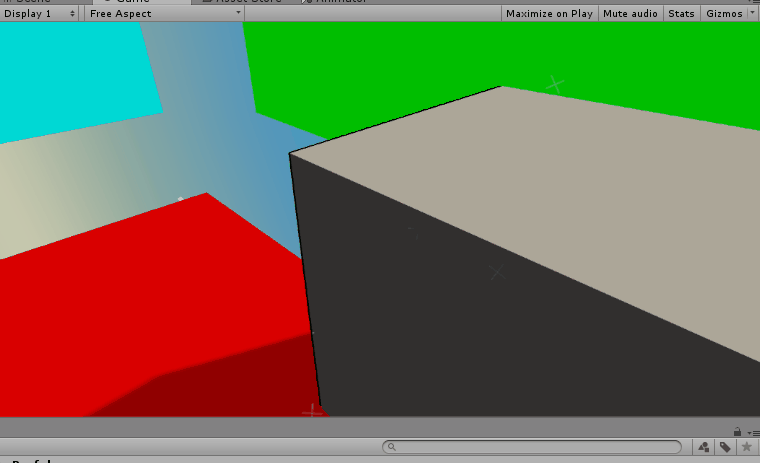

In this tutorial, we’ll implement a teleportation mechanic for a VR
puzzle game where the player solves puzzles, by teleporting onto
surfaces like walls and ceilings, to change which way gravity points.
The objective of each level is to move weighted Tokens to Goals.

VR is new and doesn’t have very many standards yet, but one that is
becoming popular is teleportation. We encourage you, for your own
projects, to try and think of a more creative alternative, but we do
think it’s useful to learn how to implement teleportation in case you
ever want to use it.

In this tutorial, we’ll implement:

-   A player that can launch out a beam and teleport onto surfaces!

-   Objects that change their direction of gravity

-   Non-teleportable and teleportable surfaces

-   A screen transition during teleportation

If you’d like to go on after the basic tutorial, we’ll also show you how
to make:

-   Beam-bouncing surfaces, like mirrors

-   Beam-bending objects, like prisms!
