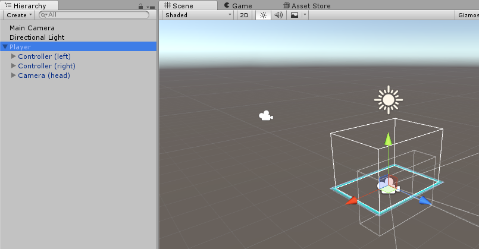

>[action]
>To begin, create a new 3D Project in Unity named “Teleportation,” and import SteamVR from the Asset Store.

For our game, we’ll want a pretty standard player (a head and two hands), so the simplest place to start is with the SteamVR \[Camera Rig\] Prefab.

>[action]
>Go ahead and create the Player.

We’ve renamed the \[Camera Rig\] to “Player,” because that’s more descriptive to our game. We’ve also turned Player into a Prefab, so that we can use it in more than one level without having to copy-paste it every time or recreate it.

Now we want some sort of test environment that we’ll be able to use to teleport around.

>[action]
>Make some test environment.

We’ve made an inverted box out of differently colored Planes so that we could clearly distinguish each surface and so that we could try teleporting to walls at many different angles from each other.

Before you test it, be sure to remove Main Camera! Remember, the main camera you use is the first one Unity finds that’s tagged “MainCamera,” so it’s best to avoid having multiple in the Scene if they’re all active.

We’re going to teleport the player using a point-and-shoot mechanic in which the Player will aim a hand at the ground and press a button on the controller to teleport to that spot, if the player can. In order to both test this and to give real players feedback, we’re going to project a Laser and Reticle onto the surface at which we’re pointing and encode it with visual information so that the player can look and see “Oh hey! I can totally teleport there” or “Looks like a I can’t teleport there, better try something else.”

SteamVR provides a built-in Laser Pointer (SteamVR/Extras/LaserPointer), which you can drag onto your hand object directly, but we’re going to build our own ;). If you’d like to see it though, feel free to play around with the laser pointer, just be sure to remove it when you’re done.

(SteamVR also provides a Teleporter, and you're welcome to play around with this too, though this requires [a little extra set-up](http://www.vrstorytelling.org/fixed-teleporting-with-the-vive-in-unity/). The tl;dr, you can use it by adding a SteamVR_TrackedController, SteamVR_Teleporter, and SteamVR_LaserPointer to your hand.)

Our eventual goal is to make a system in which both hands can work as a teleportation gun, but in order to get things up-and-running quickly, we’re going to start with just one hand and then modify our design to
make it more general. This approach is a pretty good one to prevent over-engineering a design; build just what you need, and then modify it to fit your needs. You may even find in testing that the simpler version is compelling enough to keep and that there's no need to complicate.
