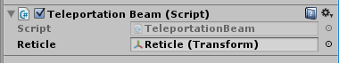
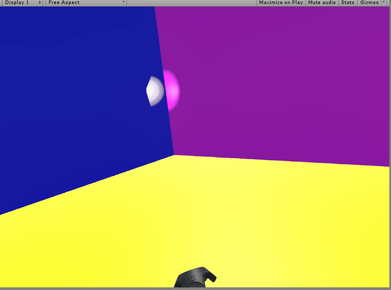
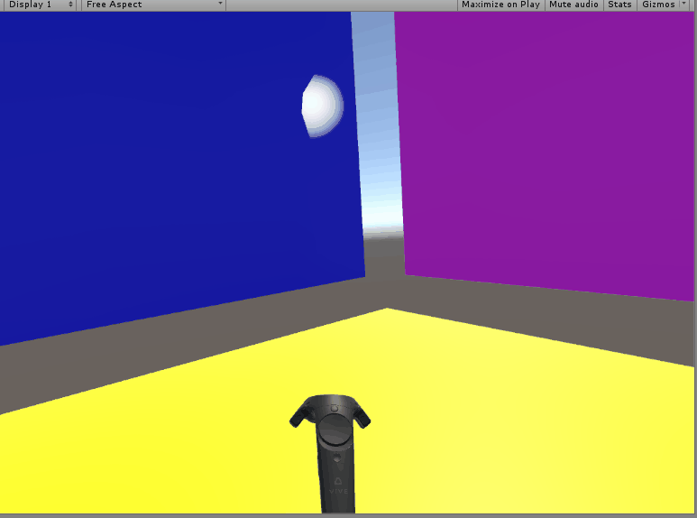
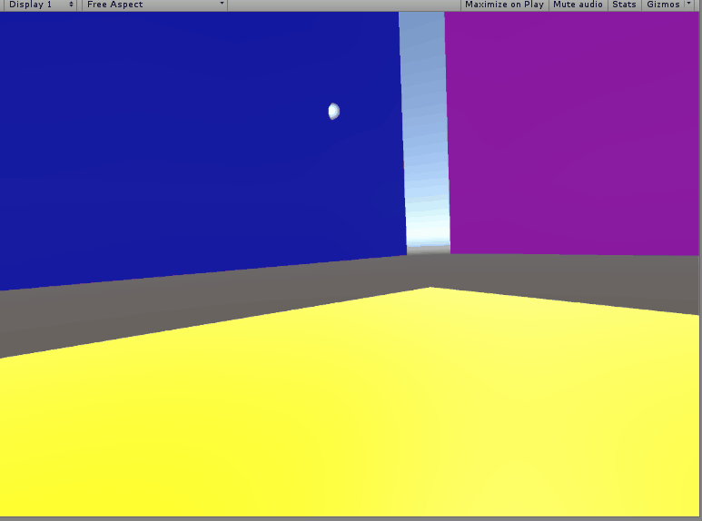
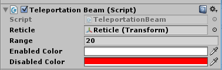

First, we’re going to make reticle that appears on the wall at the point
at which we’re aiming.

Create and add a TeleportationBeam component to whichever hand you’d
like to use for testing (we used our left) and put the following code
into it:

```
using UnityEngine;
using System.Collections;

public class TeleportationBeam : MonoBehaviour {

  public Transform reticle;

  // Use this for initialization
  void Start () {

  }

  // Update is called once per frame
  void Update () {

    RaycastHit hit;
    Ray ray = new Ray(transform.position, transform.forward);

    if (Physics.Raycast(ray,out hit)) {
      reticle.position = hit.point;
    }
  }
}
```

Then create and assign a Reticle to the component’s Reticle slot. We
used a Point Light with haloing turned on as your Reticle.





Physics.Raycast is a method that returns true if a Ray (a geometric body
with both position and direction, so like a vector that never ends and
has a position in space) passes through a Collider, like those on our
Planes and Cubes. If a Collider is hit, information from that hit is
passed into the funny looking parameter “out hit” in the form of a
RaycastHit. The “out” means that this variable can be modified by the
function and then comes back to us as output. For a more technical
definition, “out” means the variable is passed by reference and will be
initialized within the function.

For our Ray, we’ve chosen one that starts at the hand’s position and
points the way our hand is pointing.

There’s an edge case our code misses though. If you change your level
such that there are gaps between the walls, you can see it. Watch what
happens when you drag your aim across a gap.



The reticle appears to “stick” to its old position when we pass over
gaps, i.e. when we’re not aiming at anything.

In order to fix this, we not only have to identify what to do
technically, but also have to make a design decision: what should the
reticle do when the player isn’t aiming at anything?

How do you want to resolve this issue? Go ahead and implement a fix.
Some helpful things to note: there are lots of forms of Physics.Raycast.
Our implementation makes use of adding a range parameter, but there are
lots of others.

We decided that our beam should have some maximum distance, and that if
the beam doesn’t hit a wall, it counts as a miss. To show a miss, we
decided to show the reticle at that max distance, but made it turn red.



We implemented this by changing our code and setting the public
variables in the Editor:

```
using UnityEngine;
using System.Collections;

public class TeleportationBeam : MonoBehaviour {

  public Transform reticle;
  public float range;

  public Color enabledColor;
  public Color disabledColor;

  private Light reticleLight;

  // Use this for initialization
  void Start () {
    reticleLight = reticle.gameObject.GetComponent<Light>();
  }

  // Update is called once per frame
  void Update () {

    RaycastHit hit;
    Ray ray = new Ray(transform.position, transform.forward);

    reticle.position = ray.origin + ray.direction * range;
    reticleLight.color = disabledColor;

    if (Physics.Raycast(ray, out hit, range)) {

      reticle.position = hit.point;

      reticleLight.color = enabledColor;
    }
  }
}
```


