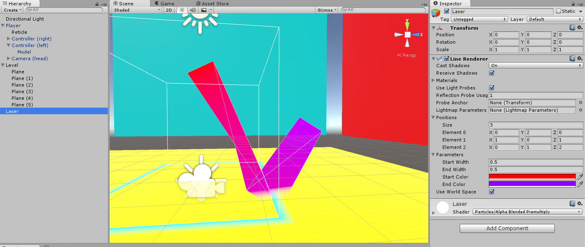
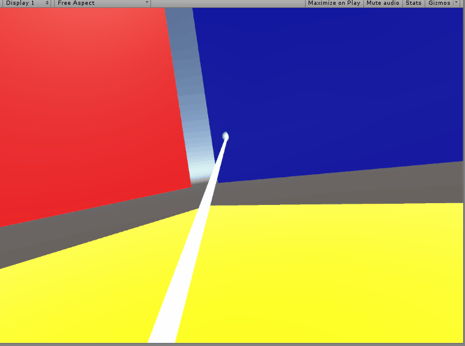
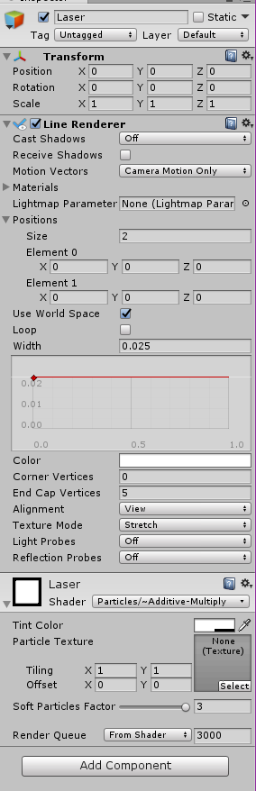

Now it’s time to create a laser that extends from our hand to the Reticle.

To do this, we can use the Line Renderer component. The Line Renderer component renders a line through any set of points you specify for it.

If you want to see what it looks like, you can create an Empty Game Object with a Line Renderer on it and try playing around with its properties. You can change the line width at the beginning and end, tell it to travel through a new set of positions, change how many positions it travels through, etc. If you want to change the color, you’ll need to give it a Material with a Shader that will let the colors show up. One that works well is Particles/Alpha Blended Premultiply.



>[action]
>Try adding code to make a laser beam that extends from your hand to the Reticle. As a hint, given a Line Renderer lr and a generic List of Vector3s, waypoints, you can set its positions by saying:
>
```
lr.SetVertexCount(waypoints.Count);
lr.SetPositions(waypoints.ToArray());
```



>[solution]
>
We changed our code to look like this:
>
```
using UnityEngine;
using System.Collections;
>
using System.Collections.Generic;
>
public class TeleportationBeam : MonoBehaviour {
>
  public Transform reticle;
  public LineRenderer laser;
  public float range;
>
  public Color enabledColor;
  public Color disabledColor;
>
  private Light reticleLight;
>
  // Use this for initialization
  void Start () {
    reticleLight = reticle.gameObject.GetComponent<Light>();
  }
>
  // Update is called once per frame
  void Update () {
>
    RaycastHit hit;
    Ray ray = new Ray(transform.position, transform.forward);
>
    List<Vector3> waypoints = new List<Vector3>();
    waypoints.Add(transform.position);
>
    reticle.position = ray.origin + ray.direction * range;
>
    reticleLight.color = disabledColor;
    laser.SetColors(disabledColor, disabledColor);
>
    if (Physics.Raycast(ray, out hit, range)) {
>
      reticle.position = hit.point;
      reticleLight.color = enabledColor;
>
      laser.SetColors(enabledColor, enabledColor);
    }
>
    waypoints.Add(reticle.position);
>
    laser.SetVertexCount(waypoints.Count);
    laser.SetPositions(waypoints.ToArray());
  }
}
```
>
The public Line Render variable was filled in the Editor by creating an Empty Game Object with a Line Renderer (like the one we were playing with!) and dragging it in.
>
Because we didn’t want our laser to cast shadows, we turned off all shadow-casting properties on the Line Renderer.
>

