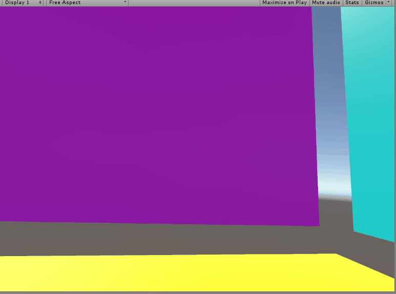

Now we have some pretty good visual indicators to show where we’ll teleport when we press the teleport button.

However, it’s kind of obnoxious to have to look at a laser shooting out of our controller all the time, and it would be even more annoying with two hands. We’d like our laser and reticle to only appear when we’re holding down the teleport button and then for the actual teleportation to occur when we release the button. Then, when we release it, we’d like to actually teleport.

Since we don’t want to implement too many things at once, we’re first going to take a baby step in this direction by making our beam only appear when we hold down the teleport button (we’ll use the Trackpad), and then doing… something with the hit information when we release that button, for example, spawning a sphere at the hit point. Of course we’ll take out this code when we implement the actual teleport mechanic, but, for now, spawning a sphere is a very visual thing we can do to let ourselves know we’ve done something correct with the data.

>[action]
>Go ahead and make the Laser and Reticle both only appear when you’re holding down the Trackpad, and then make a sphere appear when you release it.

Here are a few hints to get you started, since this can be a bit involved (“Baby step” may appropriately in the case of a hippo):

Given a SteamVR\_TrackedObject, controller, you can check whether or not the Trackpad is currently pressed in the following way:

```
SteamVR_Controller.Device device = SteamVR_Controller.Input((int)controller.index);

if (device.GetPress(Valve.VR.EVRButtonId.k_EButton_Axis0) {
  Debug.Log(“We’re pressing the trackpad!”);
}
```

and to check a trackpad release, it’s the same, but “GetPressUp” instead of “GetPress.”

You can make Game Objects inactive (i.e. invisible) or active (i.e. visible) by calling SetActive(isActive) on them, where “isActive” is a bool.

Be sure to test it out and have a good time making some giant worm beasts.



>[solution]
>
>We implemented this by changing our code to look like the following:
>
```
using UnityEngine;
using System.Collections;
using System.Collections.Generic;
>
public class TeleportationBeam : MonoBehaviour {
>
  public Valve.VR.EVRButtonId buttonId = Valve.VR.EVRButtonId.k_EButton_Axis0;
>
  public Transform reticle;
  public LineRenderer laser;
  public float range;
>
  public Color enabledColor;
  public Color disabledColor;
>
  private Light reticleLight;
>
  private SteamVR_TrackedObject controller;
>
  private RaycastHit target;
  private bool canTeleport;
>
  // Use this for initialization
  void Start () {
>
    reticleLight = reticle.gameObject.GetComponent<Light>();
    controller = GetComponent<SteamVR_TrackedObject>();
  }
>
  // Update is called once per frame
  void Update () {
>
    SteamVR_Controller.Device device = SteamVR_Controller.Input((int)controller.index);
>
    if (device.GetPress(buttonId)) {
>
      canTeleport = false;
>
      laser.gameObject.SetActive(true);
      reticle.gameObject.SetActive(true);
>
      RaycastHit hit;
      Ray ray = new Ray(transform.position, transform.forward);
>
      List<Vector3> waypoints = new List<Vector3>();
      waypoints.Add(transform.position);
>
      reticle.position = ray.origin + ray.direction * range;
>
      reticleLight.color = disabledColor;
      laser.SetColors(disabledColor, disabledColor);
>
      if (Physics.Raycast(ray, out hit, range)) {
>
        reticle.position = hit.point;
>
        reticleLight.color = enabledColor;
        laser.SetColors(enabledColor, enabledColor);
>
        target = hit;
        canTeleport = true;
      }
>
      waypoints.Add(reticle.position);
>
      laser.SetVertexCount(waypoints.Count);
      laser.SetPositions(waypoints.ToArray());
>      
    } else {
>
      laser.gameObject.SetActive(false);
      reticle.gameObject.SetActive(false);
>
    }
>
    if (device.GetPressUp(buttonId) && canTeleport) {
>
      GameObject go = GameObject.CreatePrimitive(PrimitiveType.Sphere);
      go.transform.position = target.point;
    }
  }
}
```
>
In order to not allow an up press occurring after an invalid beam cast to count as a teleport, we added the canTeleport flag, which we set to false on every trackpad press. We only set it to true if we hit something, so that only a valid press will lead to a valid up press.
>
We also decided to make the buttonId a public variable (with a default value) so that we could set that from the Editor if we ever changed our minds about which button we wanted to use as the teleport button. In
general, this is a pretty good idea, and, if our component weren’t already named “TeleportationBeam” we would have picked a name more descriptive of teleportation, like “teleportButtonId.” Given the context though, it seemed redundant to add the word “teleport” in there.
