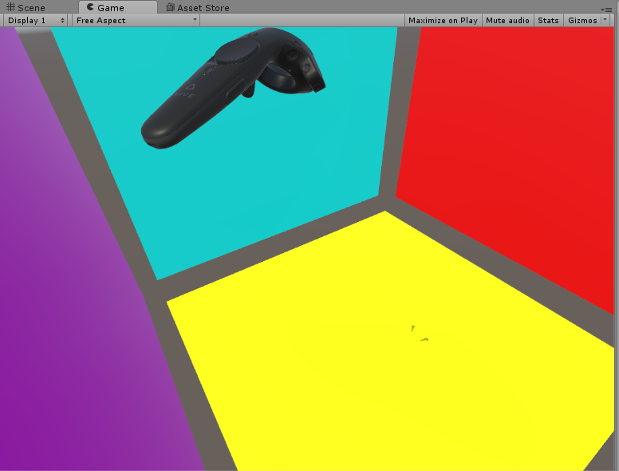
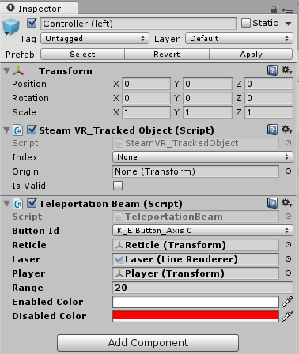
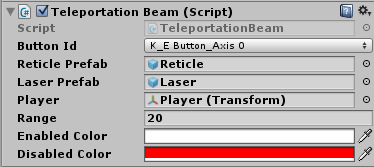
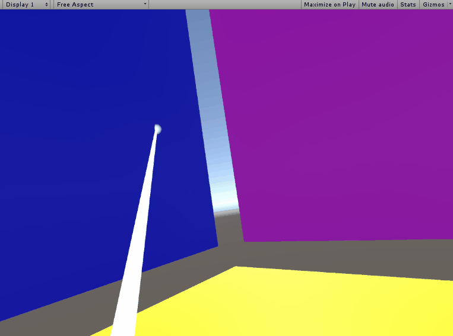
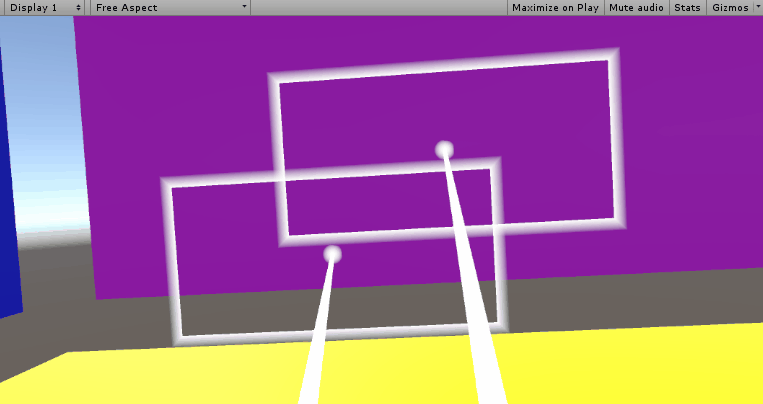
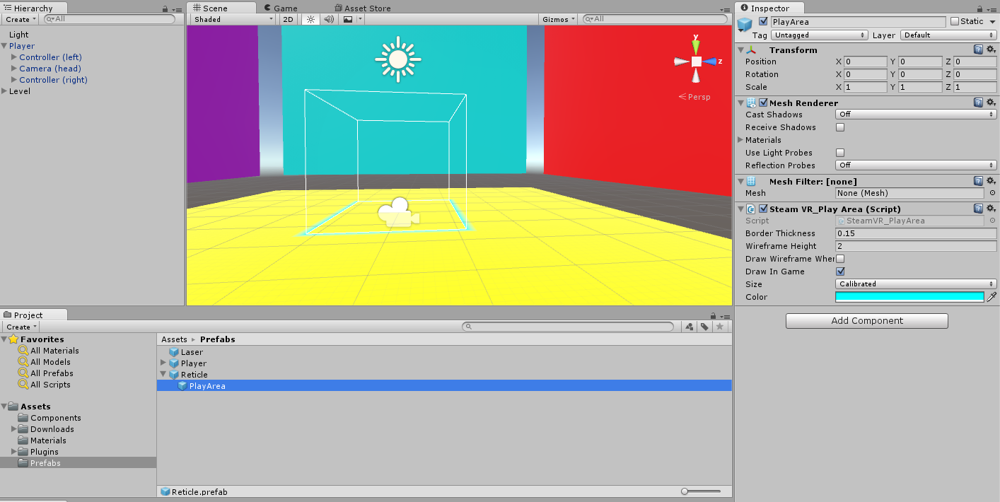

Now it’s time to actually teleport our Player!

In order to do this, we’ll just need to replace the Sphere spawning code with some code to position our Player at the target point. That means we’ll need access to our Player’s transform.

>[action]
>Go ahead and replace the sphere-spawning code with code that repositions your Player -- don’t worry about rotation just yet.

By the way, if you have a fear of heights, we don’t recommend looking down when you teleport, since you’ll still be rotated facing “up.”



>[solution]
>
We did this by adding a public variable to reference our Player’s transform:
>
```
public Transform player;
```
>
Then changed the sphere-spawning code to be this line:
>
```
player.position = target.point;
```
>
Then we just dragged a reference of our Player into the resulting slot
we created.
>


In order to reorient our Player, we just need to make our Player’s up direction face the same as the normal of the target point we hit. Luckily, our hit gives us access to the normal. You can access the normal of any RaycastHit, hit, by saying “hit.normal.”

>[action]
>Go ahead and make the Player teleport to the correct orientation by making the player's up direction face the same as the normal.

<!-- -->

>[info]
This method of orienting the player is good enough to get us going, HOWEVER it is not perfect.  This will keep your feet to the wall when you land, but there is an additional degree of freedom!  Which way should the player face rotationally? This tutorial will not address that issue, but we suggest that you come back to that problem at the end.  It is challenging!

<!-- -->

>[solution]
>
>We did this by changing our teleport code to look like this:
>
```
player.position = target.point;
player.up = target.normal;
```

Now we have our basic teleport mechanic in place for one hand. We’re going to now make it work on BOTH hands.

This means that we’ll want a second Laser and Reticle, BUT we may want to change how our Laser or Reticle look at some point in the future, so copy-pasting them isn’t a great option.

Prefabs to the rescue!

>[action]
>Turn your Laser and Reticle into Prefabs, and make your component generate them rather than reference pre-existing instances in the Scene. When you do this, your Scene should run the same as before!

<!-- -->

>[solution]
>
After we turned our Laser and Reticle into Prefabs, we added two public member variables to TeleportationBeam:
>
```
public GameObject reticlePrefab;
public GameObject laserPrefab;
```
>
and we made the old variables that referenced our Laser and Reticle private:
>
```
private Transform reticle;
private LineRenderer laser;
```
>
Then we changed our Start method to look like this:
>
```
void Start() {
>
  GameObject laserObj = (GameObject)Instantiate(laserPrefab);
  GameObject reticleObj = (GameObject)Instantiate(reticlePrefab);
>
  laserObj.transform.SetParent(player);
  reticleObj.transform.SetParent(player);
>
  reticle = reticleObj.transform;
  laser = laserObj.GetComponent<LineRenderer>();
>
  reticleLight = reticle.gameObject.GetComponent<Light>();
  controller = GetComponent<SteamVR_TrackedObject>();
}
```
>
We dragged references to our Laser and Reticle from our Project Panel into the new slots we made in the Editor:
>

>
Then we deleted the original Laser and Reticle from our Scene.
>
Making the old variables private wasn’t strictly necessary to our implementation, but we did it for two reasons: (1) the variables no longer need to be accessed publicly, and (2) by making the variables
private, they no longer appear in the Inspector, which saves us some visual clutter.
>
We also didn’t need to set the newly created objects to be children of the player, but we did this so that the Hierarchy panel wouldn’t be cluttered when we ran the game, and we’d be able to collapse Player down nicely.

You may be wondering: why didn’t we just drag copies of the Prefabs into the Hierarchy directly and access those rather than creating them programmatically? Well, this would have created a need for us to do this
for EVERY hand we wanted to outfit with the TeleportationBeam. You may be thinking, “a Player will only ever have two hands! That’s no big deal!” and that’s true, but if you want to make a new level, you need to make a new Player for that level. We could get around this if the Reticle and Laser Prefab were nested under the Player Prefab -- then we
could just drag out a Player Prefab, and it would already have the other Prefabs attached to it; HOWEVER nested Prefabs in Unity do NOT retain their Prefab links. This means we’d lose the utility of them being
Prefabs in the first place.

Now to dual wield TeleportationBeams, all you should need to do is drag a new TeleportationBeam component onto your other hand.

>[action]
>Do that, and set up any additional properties you need to set up. As a tip, if you want to give your component’s public properties default values, you can set them inline as assignments BEFORE you add the component to an object, and that version of the component will have them:
>
```
public float range = 20f;
>
public Color enabledColor = Color.white;
public Color disabledColor = Color.red;
```
>
Be sure to test to make sure both work!



Feel free to take a few moments to customize your Beam and Reticle.



>[solution]
>
We added a SteamVR\_PlayArea as a child of our Reticle and made our Reticle reorient based on the expected teleportation orientation.
>
In doing this, we also found it helpful to encapsulate our Reticle and Laser as components, so that we didn’t have so much confusing clutter in our TeleportationBeam that was so specific to how the beam was drawn.
>
Our new components looked like this:
>
```
using UnityEngine;
using System.Collections;
>
[RequireComponent(typeof(LineRenderer))]
public class Laser : MonoBehaviour {
>
  LineRenderer lr;
>
  // Use this for initialization
  void Start () {
    lr = GetComponent<LineRenderer>();
  }
>
  // Update is called once per frame
  void Update () {
>
  }
>
  public void SetColor(Color color) {
    lr.SetColors(color, color);
  }
>
  public void SetWaypoints(Vector3[] waypoints) {
>
    lr.SetVertexCount(waypoints.Length);
    lr.SetPositions(waypoints);
  }
}
```
>
and
>
```
using UnityEngine;
using System.Collections;
>
[RequireComponent(typeof(Light))]
public class Reticle : MonoBehaviour {
>
  private Light halo;
  public SteamVR_PlayArea playArea;
>
  // Use this for initialization
  void Start () {
    halo = GetComponent<Light>();
  }
>
  // Update is called once per frame
  void Update () {
>
  }
>
  public void SetColor(Color color) {
>
    halo.color = color;
    playArea.color = color;
  }
>
  public void ShowPlayArea(bool doShow) {
    playArea.enabled = doShow;
    playArea.gameObject.SetActive(doShow);
  }
}
```
>
And our TeleportationBeam component changed to look like this:
>
```
using UnityEngine;
using System.Collections;
using System.Collections.Generic;
>
public class TeleportationBeam : MonoBehaviour {
>
  public Valve.VR.EVRButtonId buttonId = Valve.VR.EVRButtonId.k_EButton_Axis0;
>
  public GameObject laserPrefab;
  public GameObject reticlePrefab;
  public Transform player;
>
  private Reticle reticle;
  private Laser laser;
>
  public float range = 20f;
>
  public Color enabledColor = Color.white;
  public Color disabledColor = Color.red;
>
  private SteamVR_TrackedObject controller;
>
  private RaycastHit target;
  private bool canTeleport;
>
  // Use this for initialization
  void Start() {
>
    GameObject laserObj = (GameObject)Instantiate(laserPrefab);
    GameObject reticleObj = (GameObject)Instantiate(reticlePrefab);
>
    laserObj.transform.SetParent(player);
    reticleObj.transform.SetParent(player);
>
    reticle = reticleObj.GetComponent<Reticle>();
    laser = laserObj.GetComponent<Laser>();
>
    controller = GetComponent<SteamVR_TrackedObject>();
  }
>
  // Update is called once per frame
  void Update() {
>
    laser.gameObject.SetActive(false);
    reticle.gameObject.SetActive(false);
>
    SteamVR_Controller.Device device = SteamVR_Controller.Input((int)controller.index);
>
    if (device.GetPress(buttonId)) {
>
      canTeleport = false;
>
      laser.gameObject.SetActive(true);
      reticle.gameObject.SetActive(true);
>
      RaycastHit hit;
      Ray ray = new Ray(transform.position, transform.forward);
>
      List<Vector3> waypoints = new List<Vector3>();
      waypoints.Add(transform.position);
>
      reticle.transform.position = ray.origin + ray.direction * range;
>
      if (Physics.Raycast(ray, out hit, range)) {
>
        target = hit;
        canTeleport = true;
>
        reticle.transform.position = target.point;
        reticle.transform.up = target.normal;
>
      }
>
      waypoints.Add(reticle.transform.position);
>
      laser.SetWaypoints(waypoints.ToArray());
>
      Color color = canTeleport ? enabledColor : disabledColor;
      laser.SetColor(color);
      reticle.SetColor(color);
      reticle.ShowPlayArea(canTeleport);
    }
>
    if (device.GetPressUp(buttonId) && canTeleport) {
>
      player.position = target.point;
      player.up = target.normal;
    }
  }
}
```
>
The new components were added to our Laser and Reticle respectively, and our Reticle’s overall structure was changed to include a child with a SteamVR\_PlayArea component attached to it.
>

