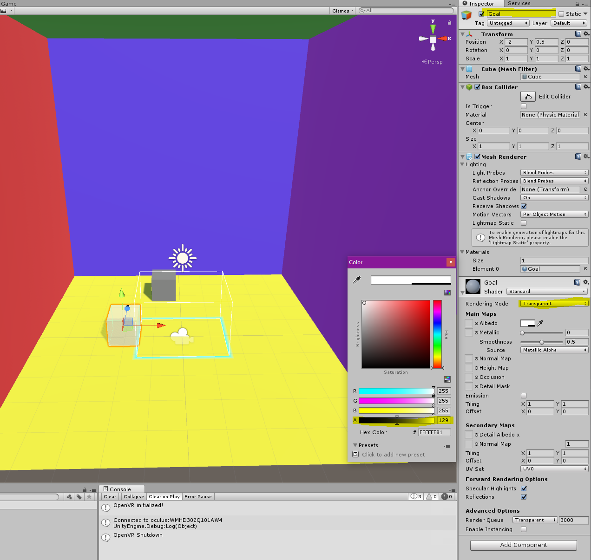

We’re now going to take a brief break from teleportation to add some gameplay elements. In particular, we’re going to add some Tokens that will change their gravity based on the Player’s orientation, and a Goal that will signal a win when the Token reaches it.

>[action]
>Go ahead and create a Goal Prefab and a Token Prefab. To distinguish them, make the Goal clear and the Token opaque.



We’re going to make our Goal work not just by detecting whether or not it’s touched the Token, but whether or not the Token is inside its bounds, within some threshold.

In order to allow ourselves to do this kind of detection, change Goal’s Collider to be a Trigger.


>[action]
>Then make the goal destroy the token when the token falls inside it. To test this, it may be easiest to place the Token directly above the Goal.
>


<!-- -->

>[solution]
>
To do this, we tagged our Token with the new tag “Token,”
<

>
and added the following component to our Goal:
>
```
using UnityEngine;
using System.Collections;
>
public class Goal : MonoBehaviour {
>
  public float threshold;
>
  void OnTriggerStay(Collider col) {
>
    if (col.CompareTag("Token")) {
>
      float distSq = (col.transform.position - transform.position).sqrMagnitude;
>
      if (distSq <= Mathf.Pow(threshold,2f)) {
        Destroy(col.gameObject);
      }
    }
  }
>
}
```

With threshold set to 0.5 in the Inspector.

The final two steps our gameplay needs is to make all the Tokens be affected by a gravitational field relative to the Player, and to make the game restart when there are no more tokens left!

>[action]
>Go ahead and make your Tokens change gravity based on the Player’s direction. We suggest using the ConstantForce component -- a component that allows you to apply a constant force in ANY direction -- and turning off gravity on the Token’s Rigidbody.


>[solution]
>
>To do this, we created a component a Game Object with a new component, ScenePlay, attached to it that’s defined like this:
>
```
using UnityEngine;
using System.Collections;
>
public class ScenePlay : MonoBehaviour {
>
  public Transform player;
  public ConstantForce token;
>
  // Use this for initialization
  void Start () {
>
  }
>
  // Update is called once per frame
  void Update () {
    token.force = -player.up * Physics.gravity.magnitude;
  }
>
}
```
>
The Token and Player were, of course, dragged into the slots that appeared in the Inspector.

Now to make the game restart, we just need to check whether or not our Token is still alive.

>[action]
>Go ahead and make the Scene restart when there are no more Tokens remaining. Be sure you Build lights if you don’t want your Scene’s lighting to change when it loads!

<!-- -->

>[solution]
>
We implemented our win by changing ScenePlay to look like this:
>
```
using UnityEngine;
using System.Collections;
using UnityEngine.SceneManagement;
>
public class ScenePlay : MonoBehaviour {
>
  public Transform player;
  public ConstantForce token;
>
  private bool didEnd;
>
  // Use this for initialization
  void Start () {
>
  }
>
  // Update is called once per frame
  void Update() {
>
    if (!token && !didEnd) {
>
      didEnd = true;
      SceneManager.LoadScene(SceneManager.GetActiveScene().name);
    }
>
    if (didEnd) { return; }
>
    token.force = -player.up * Physics.gravity.magnitude;
  }
}
```

We know that our token’s been destroyed if it’s null.

We now have the core of our game, however, in implementing new features, we’ve exposed some issues with our teleportation that are specific to
our gameplay.

First of all, our teleportation implementation allows us to teleport to anything. Like, ANYTHING, including the Token and the Goal.

We don’t want our Player to be able to teleport to the goal, because…


AAAAAAHHH WHERE DID MY FLOOR JUST GO??? \*\*hurl\*\*

Further, because our Goal acts like a region rather than a solid object, we really don’t want our beam to interact with it at all.


First, let’s address our Goal.

To make our beam not interact with our Goal, we can simply add the parameter “QueryTriggerInteraction.Ignore” to our Physics.Raycast method:

```
Physics.Raycast(ray, out hit, range,1,QueryTriggerInteraction.Ignore)
```

>[action]
>Go ahead and do that.

Now your Goal and Beam should no longer collide!


Physics.Raycast has many forms, and some of them allow us to specify that we want to ignore Colliders that have isTrigger set to true, like the Goal. This new form required us to set a layer mask parameter (that mysterious 1), a set of flags represented as a 32-bit number, where each bit corresponds to a layer set to true or false. We could have also prevented ray casting onto the Goal by putting it on a separate layer from everything else; we chose this solution largely as a matter of preference (fewer steps, and it has the added benefit that our beam now also ignores collisions with any other trigger Colliders we add to our Scene).

Now for the Token.

For our Token, we don’t want to ignore collisions, because, logically, the beam shouldn’t pass through that object. Instead, we want our beam to hit, but not allow our player to teleport. Additionally, we want to reflect this visually so that we can indicate to our player “no, you cannot teleport there.”

To do this, we’ll want to make the design decision of whether we want players to ONLY be able to teleport to teleportable surfaces or to only NOT be able to teleport to NON teleportable surfaces. Either choice
could be beneficial, depending on which we want to prioritize: intentionality or discovery. Only allowing players to teleport where we want them reduces the chances of players finding exploits or bugs in our
levels, since we’ve had to specify where players can wind up, but… exploits might lead to fun discover (both before and after release), and we’re less likely to find them if we box ourselves in. Lots of popular games have gained niche followings because of exploits, others have grown acclaimed for their tight design. Many good games have a mix of both intentionality and discovery; as is common with these things, it’s not a binary.

For the purposes of this tutorial, we’re going to take the more intentional approach and specify teleportable surfaces, but you’re welcome to resolve this problem whichever way you prefer.

>[action]
>Go ahead prevent teleportation to the Token.


>[solution]
>
We did this by adding a “Teleportable” tag to all our walls, and changing the line where we were setting our canTeleport flag in TeleportationBeam to be this instead:
>
```
canTeleport = hit.collider.CompareTag("Teleportable");
```

Now our teleport interacts more appropriately with our game.
