As one final step, we’re going to add an additive dissolve (i.e. a dip-to-white) effect that will appear in front of our faces when we teleport.

We’re going to do this via a Camera effect.

>[action]
>Import the Standard Assets Effects package (Assets-&gt;Import Package-&gt;Effects) and then add a Screen Overlay component to your Camera (eye) Game Object. Set its intensity to 0 and Blend Mode to Additive.

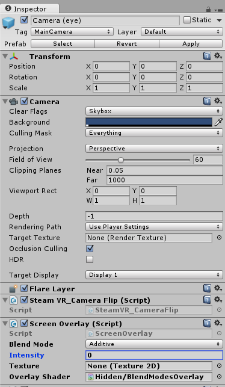

The Screen Overlay component overlays an image (or color) to the screen. You can play around with the Intensity and Blend Mode to get a rough idea of how it works.

We’re going to create the fade effect using an Animation. This is definitely NOT the quickest way to implement this effect, but we’re going to show you how, since this is a relatively simple effect and we want to get show you the basic flow for working with Animations in Unity.

>[action]
>Select Camera (eye) and then open the Animations Window
(Window-&gt;Animation)

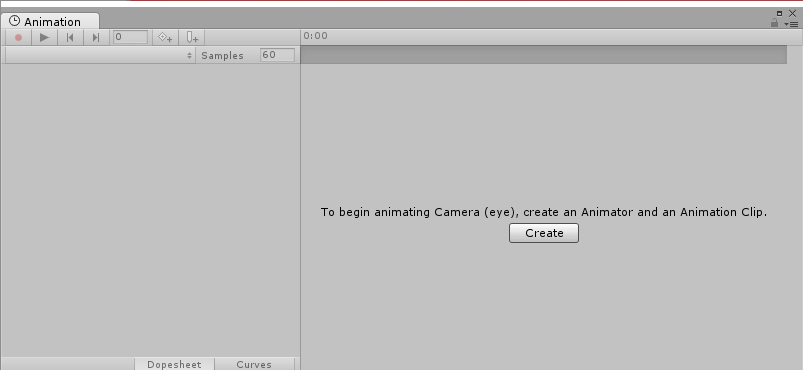

>[action]
>
Click the “Create” button and you’ll be prompted to save this new Animation somewhere. Save it to a new folder named “Animations” and name it “AdditiveDissolve\_Appear.” When you do, your Animation Window should change and you should see not only the Animation saved to your Animations folder, but also the controller.

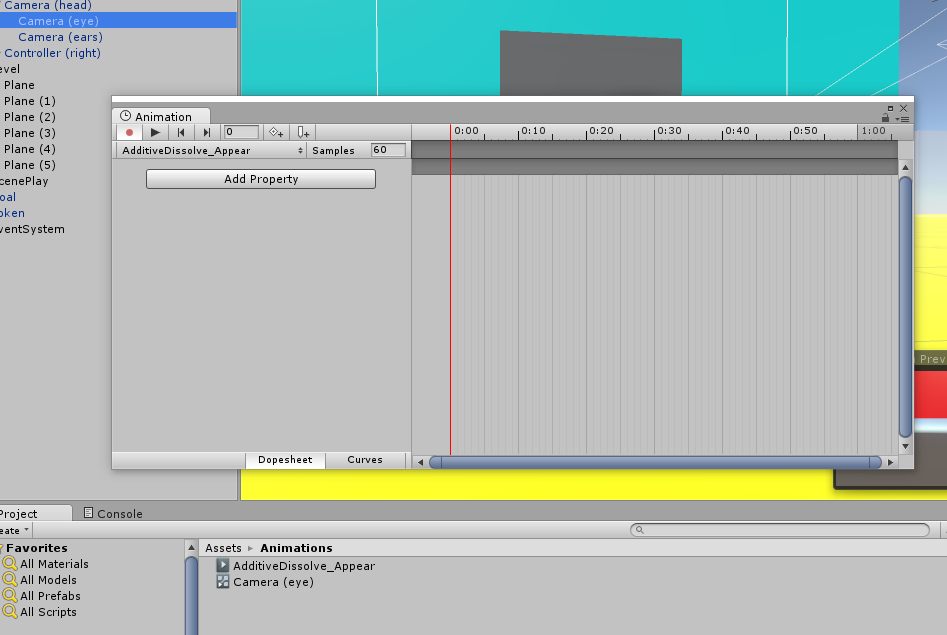

If you look in the Inspector, you’ll also notice that the Camera (eye) Game Object now has an additional Animator component attached to it.

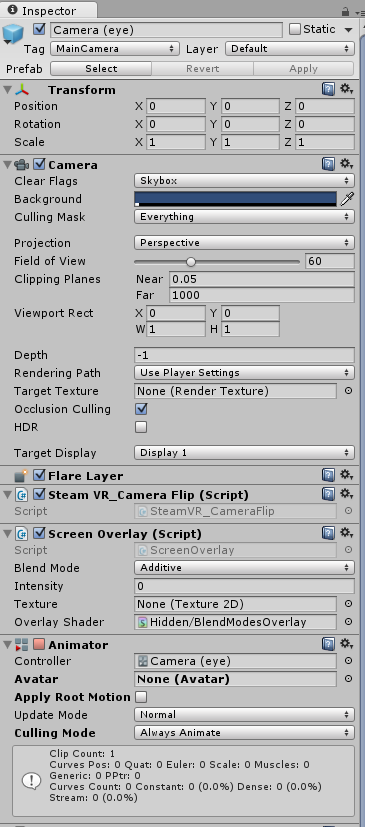

You may also notice that the Play buttons up top are now red and that the Apply button in the Inspector is greyed out. The red indicates that you are in Record Mode, and that changes you make to your component may be recorded as keyframes. When you’re in Record Mode, you cannot Apply Prefabs. You can exit (or re-enter) Record Mode at any time by clicking the red circle icon in the Animations Window or by closing the window.

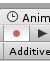

Now we’re going to create the animation of the white layer fading in, which will play when we start teleporting.

>[action]In the Animation Window, select Add Property, and then navigate to the Intensity property of the Screen Overlay and click the little plus symbol. The property should appear with two keyframes in the timeline.

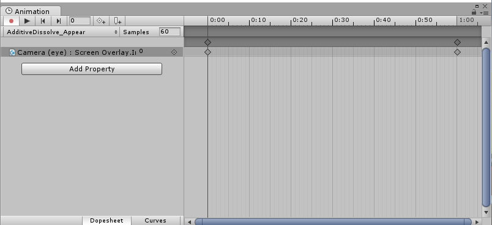

>[action]
> The default keyframes set are a bit far apart, and we want our animation to be relatively quick, so as not to make players impatient, so click and drag the farthest keyframe closer, to reduce the animation length.

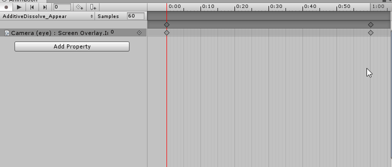

>[action]
> Now select the last keyframe and change the value from 0 to 5.

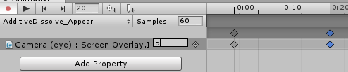

If you select the Game View, you should be able to see this change, and can even play it back (and stop it) with the Play arrow in the Animation Window or by scrubbing.

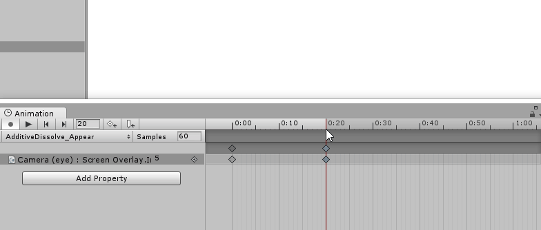

If you try to play the game, you’ll notice that this animation loops forever and never stops!

>[action]
>To fix that, select the animation in the Project Panel, and then uncheck Loop Time in the Inspector.

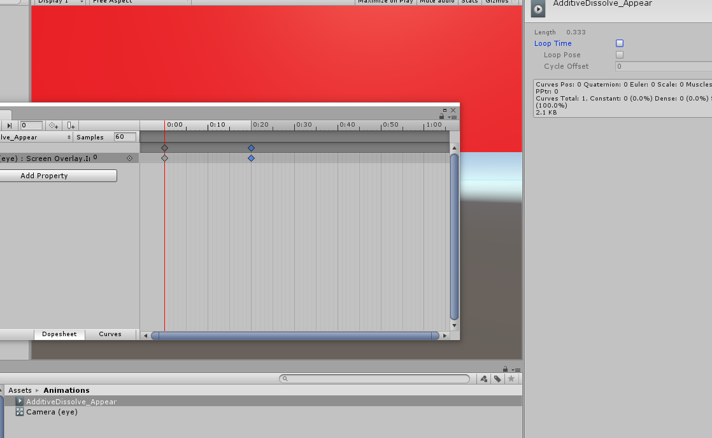

>[action]
>Now do the same thing to create an AdditiveDissolve\_Disappear animation that starts white and ends clear. Be sure to set it also to not loop!

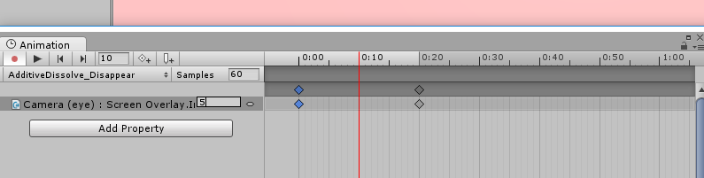

All right, we have these animations, so what? How do we call them?

We’re going to call our animations indirectly by triggering transitional states, which we’ll set up in the Animator Window.

>[action]
>Close the Animation Window, and open the Animator Window (Window-&gt;Animator). Select Camera (eye) and you should see our animations represented as a flow chart.

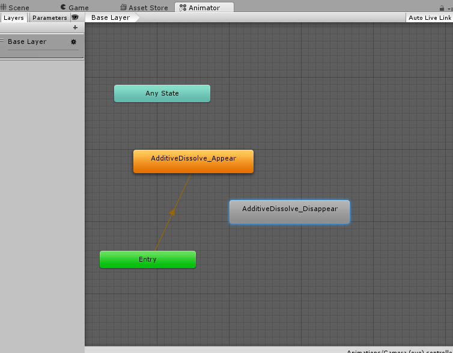

Each node represents a state of the animation, and each arrow represents a transition from one state to the next. If you like technical terms, this is the representation of your animation as a finite state machine! Any State represents any state in the machine, and Entry is the start point of your animation. By default, it points to the first animation you created.

>[action]
>Right-click on AdditiveDissolve\_Appear and select “Make Transition” and then drag the arrow to AdditiveDissolve\_Disappear.

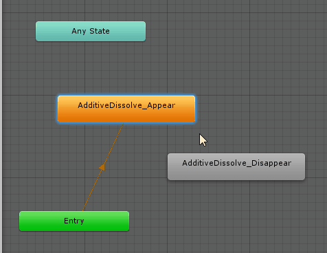

If you select the arrow you just created, you’ll see in the Inspector properties of this transition.

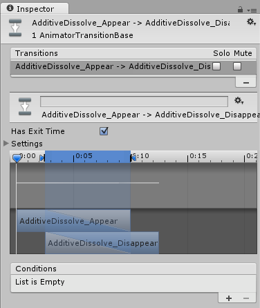

Because we have no conditions set, AdditiveDissolve\_Appear will lead directly into AdditiveDissolve\_Disappear whenever it completes.

Now create a transition from Any State to AdditiveDissolve\_Appear.

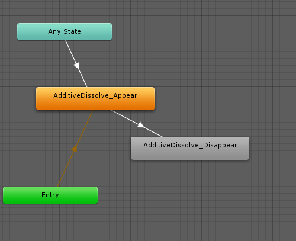

We’re going to add a condition to this transition using something totally unrelated to colliders, but also called a Trigger. In this sense, a Trigger is a boolean that gets reset to false at the end of the frame, so whenever we set it, Unity knows that it was just set this frame and can use it to trigger a one-time thing.

Different parameter types are useful for different types of animations. Bools are good for states like “Idle” vs “Falling.” Ints work well for things that inherently have levels built in, like “Fatigue 1,” “Fatigue 2”, etc. Floats are great for actions that measure the same value, like “Walking” vs “Running,” which may depend on magnitude of velocity. Because of their one-shot nature, Triggers are very handy for animations that get, well… triggered… by various actions. You can also mix and match parameters on transitions.

>[action]
>In the upper left, where you have the option for Layers or Parameters,
select Parameters, if it’s not already selected.
>
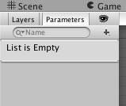
>
Then click the + symbol, select trigger, and fill in the field with the string “Appear”
>
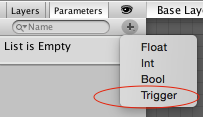
>
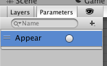
>
Then select the transition from Any State to AdditiveDissolve\_Appear and click the plus below “Conditions” to add the Trigger as a condition.

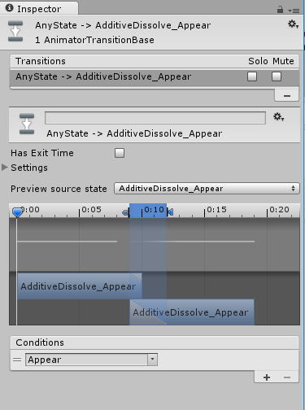

>[action]
>As one final step, right-click AdditiveDissolve\_Disappear and set it as the default animation. This will make our scene start with a nice dip from white.

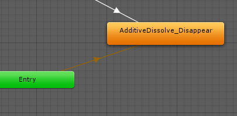

To call this additive dissolve effect, given an instance of the
Animator, animator, we can trigger the animation to begin by calling:

```
animator.SetTrigger(“Appear”);
```

>[action]
>Go ahead and call the animation when you teleport.

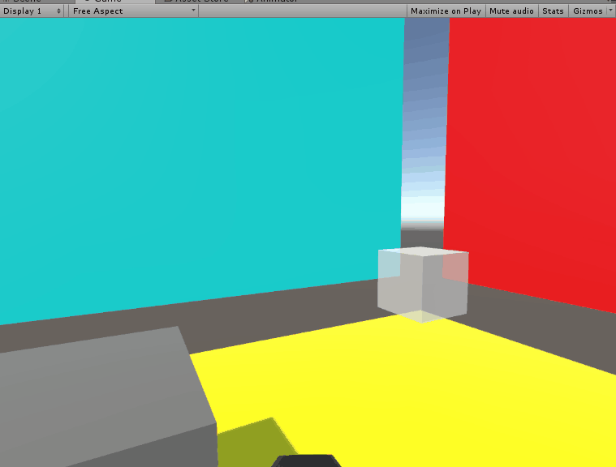

>[solution]
>
>We did this by creating a public member variable, which we populated by dragging the reference into the Inspector:
>
```
public Animator additiveDissolveAnim;
```
>
Then we called the following right before teleporting:
>
```
additiveDissolveAnim.SetTrigger("Appear");
```

You may have noticed that our animation has a bit of a problem. It doesn’t mask the movement as it should. Ideally, the player should move from point A to point B while the fade is at its peak, i.e. when the white layer is fully blocking the screen.

One way we could do this is by implementing an Animation callback, but so as not to make any of our functional code rely on any of our cosmetic stuff, we’re going to use something called a Coroutine, which allows us to wait for a certain amount of time before running some code.

To do this, we’re going to want to reference the length of our Animation Clip of the white layer appearing.

>[action]Add a public AnimationClip variable to TeleportationBeam and drag in AdditiveDissolve\_Appear from the Project Panel to fill it in.
>
```
public AnimationClip additiveDissolveClip;
```
>
Then add the following below your Update method:
>
```
private IEnumerator Teleport() {
>
  additiveDissolveAnim.SetTrigger("Appear");
>
  yield return new WaitForSeconds(additiveDissolveClip.length);
>
  player.position = target.point;
>
  player.up = target.normal;
}
```

and change your teleportation code in the Update method to look like this:

```
if (device.GetPressUp(buttonId) && canTeleport) {
  StartCoroutine(Teleport());
}
```

StartCoroutine starts the Teleport coroutine, which you can think of as a special function that can keep track of its progress over time to do things at specified times to simulate waiting. The teleport coroutine then proceeds with our teleportation as usual.

That funny "yield" syntax is used to temporarily halt execution of the Coroutine this cycle; it will pick up next cycle when the specified time has passed.

Try it out! Doesn’t that feel much smoother?

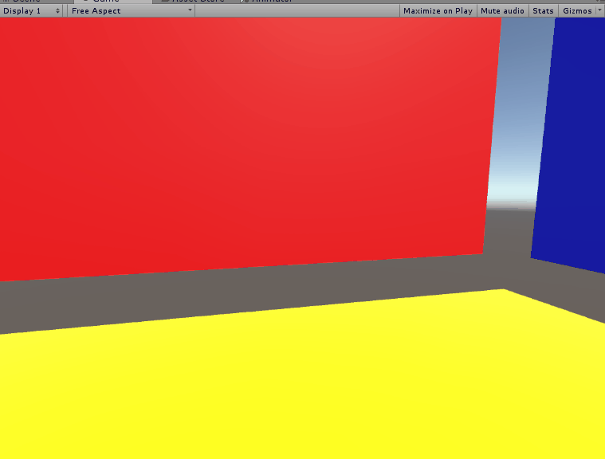

If you’d like more practice with coroutines and animation timing, go ahead and try making the game end with a dip-to-white.

>[solution]
>
We did this by changing our ScenePlay method to look like this (and, of course, dragging in the appropriate objects ;) )
>
```
using UnityEngine;
using System.Collections;
using UnityEngine.SceneManagement;
>
public class ScenePlay : MonoBehaviour {
>
  public Transform player;
  public ConstantForce token;
>
  public Animator additiveDissolveAnim;
  public AnimationClip additiveDissolveClip;
>
  private bool didEnd;
>
  // Use this for initialization
  void Start () {
>
  }
>
  // Update is called once per frame
  void Update() {
>
    if (!token && !didEnd) {
>
      didEnd = true;
      StartCoroutine(Restart());
    }
>
    if (didEnd) { return; }
>
    token.force = -player.up \* Physics.gravity.magnitude;
  }
>
  private IEnumerator Restart() {
>
    additiveDissolveAnim.SetTrigger("Appear");
>
    yield return new WaitForSeconds(additiveDissolveClip.length);
>
    SceneManager.LoadScene(SceneManager.GetActiveScene().name);
  }
}
```

Now we have a basic teleport mechanic in a fairly simple game.

Feel free to make some cosmetic tweaks to take a break from all that functionality! We decided to do some Toon shading, add a Sky Dome we found on the Asset Store, and make our beam have a moving texture, amongst other things :)

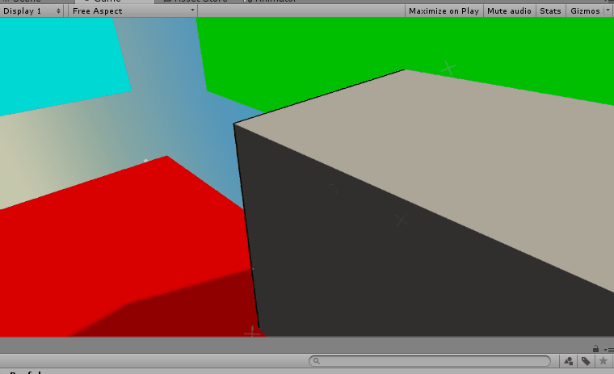

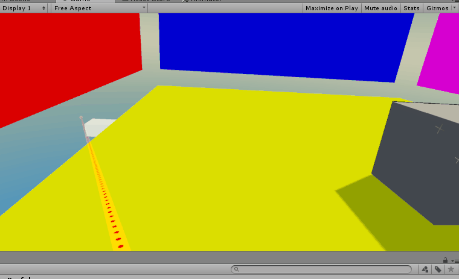

That’s it for the basic tutorial!
