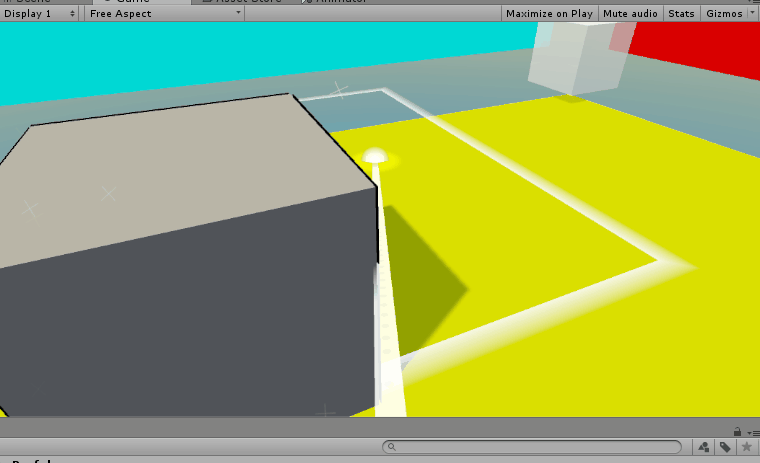
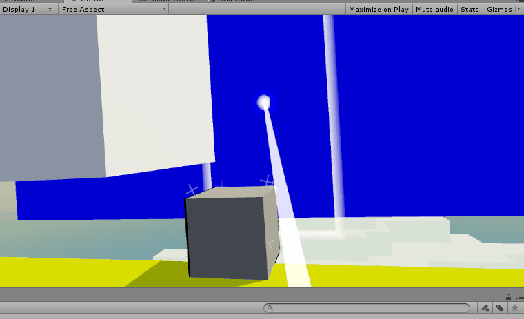

But why stop here?

We’ve got this fun beam, so why not make it do other things beams do, like reflect (like off a mirror) and refract (like off a prism)?

In order to make our beam bounce, we’ll no longer be able to rely on a single Raycast alone. Instead, depending on the surface we hit, we may want to bounce again… and again… and again!

In order to do this, we’re going to write a recursive function that does everything our code currently does: get a list of waypoints, get a reference to the final hit, and tell us whether or not we can teleport to that hit or not.

Before we even think about adding new logic, let’s try to rewrite our code as a recursive function that returns true if it can teleport, false if not, and that sets the hit and waypoints by reference.

As a tip for writing recursive functions, a good pattern to follow is to have a function with as few as possible parameters call a helper function (which will probably have many more parameters). The helper function will then call itself recursively until the task is complete and return its value to the function its helping when it reaches its end ondition.

This might look something like this pseudocode:

```
Value Foo(aParam) {
  return FooHelper(aParamInit,bParamInit,cParamInit,soManyParamsInit);
}

Value FooHelper(aParam,bParam,cParam,soManyParams) {

  if (condition) {
    Return stuff;
  }

  return FooHelper(++aParam,++bParam,++cParam,++soManyParams);
}
```

In order to pass by reference, you can use the ref or out keywords (like how we use “out” in Physics.Raycast). “out” and “ref” are actually quite similar; the main difference is that parameters passed with ref are required to be assigned BEFORE they are passed in, whereas parameters passed with out are required to assigned WITHIN the function itself.

Another good tip is to think of what your end condition will be first, i.e. how are you going to terminate your recursion? Whatever this is will probably be a parameter in your helper function that changes each
turn.

Then start by putting your code into the helper function and figuring out which of it should stay there vs what should move up a level by determining how much of it is actually general to every step and what of it is specific to the first step.

>[action]
>Go ahead and rewrite our code to use a recursive call to handle the
waypoints, final point, and whether or not we can teleport.

Be sure to test it out thoroughly and go over all the edge cases!

>[solution]
>
When we did this, the relevant functions of our code came out looking like this:
>
```
// Update is called once per frame
void Update() {
>
  SteamVR_Controller.Device device = SteamVR_Controller.Input((int)controller.index);
>
  if (device.GetPress(buttonId)) {
>
    canTeleport = false;
>
    laser.gameObject.SetActive(true);
    reticle.gameObject.SetActive(true);
>
    List<Vector3> waypoints = new List<Vector3>();
>
    if (CanTeleport(ref waypoints, ref target)) {
      canTeleport = true;
      reticle.transform.up = target.normal;
    }
>
    if (waypoints.Count > 0) {
      reticle.transform.position = waypoints[waypoints.Count - 1];
    }
>
    laser.SetWaypoints(waypoints.ToArray());
    Color color = canTeleport ? enabledColor : disabledColor;
    laser.SetColor(color);
    reticle.SetColor(color);
    reticle.ShowPlayArea(canTeleport);
  } else {
    laser.gameObject.SetActive(false);
    reticle.gameObject.SetActive(false);
  }
>
  if (device.GetPressUp(buttonId) && canTeleport) {
    StartCoroutine(Teleport());
  }
}
>
private bool CanTeleport(ref List<Vector3> waypoints, ref RaycastHit final) {
>
  Ray ray = new Ray(transform.position, transform.forward);
  waypoints.Add(transform.position);
>
  return CanTeleportHelper(ref waypoints, ref final, range, ray, false);
}
>
private bool CanTeleportHelper(ref List<Vector3> waypoints, ref RaycastHit final, float rangeRemaining, Ray ray, bool success) {
>
  if (rangeRemaining <= 0 || success) {
    return success;
  }
>
  RaycastHit hit;
>
  Vector3 waypoint = ray.origin + ray.direction * rangeRemaining;
>
  if (Physics.Raycast(ray, out hit, rangeRemaining, 1,QueryTriggerInteraction.Ignore)) {
>
    final = hit;
    waypoint = final.point;
>
    rangeRemaining -= (ray.origin - hit.point).magnitude;
>
    if (hit.collider.CompareTag("Teleportable")) {
      rangeRemaining = 0;
      success = true;
    } else {
      rangeRemaining = 0;
    }
  } else {
    rangeRemaining = 0;
  }
>
  waypoints.Add(waypoint);
>
  return CanTeleportHelper(ref waypoints, ref final, rangeRemaining, ray, success);
}
```

You may be looking at a few curious lines in CanTeleportHelper and wondering… why? In particular these:

```
if (hit.collider.CompareTag("Teleportable")) {
  rangeRemaining = 0;
  success = true;
} else {
  rangeRemaining = 0;
}
```

Yes, that’s right: in all cases, we’re setting our rangeRemaining to be 0. Range remaining is our end condition, so this will certainly make sure we terminate after one step only, but… why do we bother writing it in this weird way?

The reason is that we plan to add more conditions here, and, if we leave off the else, we get this funny behaviour whenever we hit a surface to which we cannot teleport, like the token:



This is because, without further instruction, we’re just recasting the same ray over and over until we run out of range. What we plan to do is change our input ray based on the wall type we just hit, and, in the case that we do hit a wall of no type, we do, in fact, want to just cut off the range and call it an unsuccessful, but conclusive, hit.

Now that we have our code ready and our functionality where we left it, we can extend our method to include reflection. All we need to do is pass in a reflected ray when we hit a surface that reflects.

Unity has a built-in function for us that makes getting that ray painless. We get the direction of the new ray by calling:

```
Vector3 direction = Vector3.Reflect(ray.direction, hit.normal);
```

With this in mind, implement reflection! In order to do this, you’ll of
course need to put a test objects into the Scene.

>[action]
>Implement reflection!



>[solution]
>
We modified our helper method to look like this:
>
```
private bool CanTeleportHelper(ref List<Vector3> waypoints, ref RaycastHit final, float rangeRemaining, Ray ray, bool success) {
>
  if (rangeRemaining <= 0 || success) {
    return success;
  }
>
  RaycastHit hit;
>
  Vector3 waypoint = ray.origin + ray.direction * rangeRemaining;
>
  if (Physics.Raycast(ray, out hit, rangeRemaining, 1,QueryTriggerInteraction.Ignore)) {
>
    final = hit;
    waypoint = final.point;
>
    rangeRemaining -= (ray.origin - hit.point).magnitude;
>
    if (hit.collider.CompareTag("Teleportable")) {
>
      rangeRemaining = 0;
      success = true;
>
    } else if (hit.collider.CompareTag("Reflect")) {
>
      ray.origin = hit.point;
      ray.direction = Vector3.Reflect(ray.direction, hit.normal);
    } else {
>
      rangeRemaining = 0;
    }
  } else {
>
    rangeRemaining = 0;
  }
>
  waypoints.Add(waypoint);
>
  return CanTeleportHelper(ref waypoints, ref final, rangeRemaining, ray, success);
}
```
>
Then we added a Cube to our Scene and gave it a new Reflect tag.
