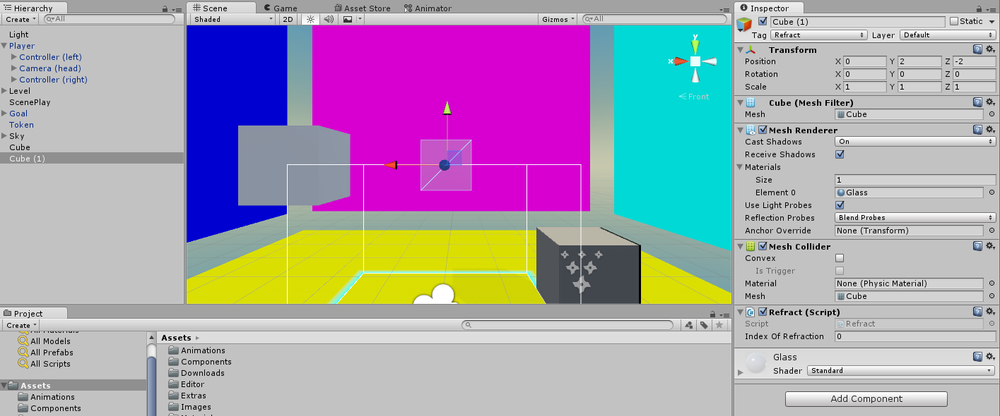
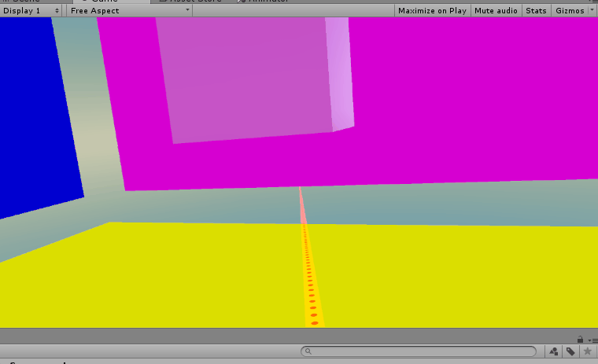
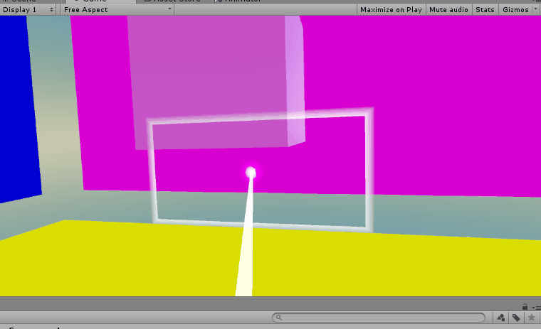
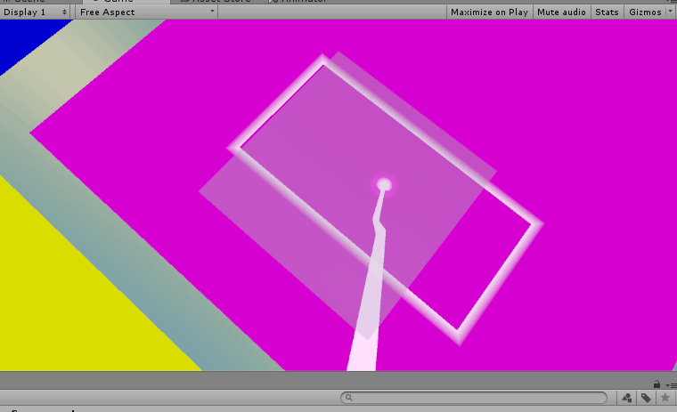

Now for refraction! The set-up for refraction is a little more challenging because it involves shooting a ray through an object from the inside and having it collide with the reverse face. If you cast a ray from within a mesh, like a Cube, however, this won’t happen; the ray will not detect a collision with the surface unless it’s approaching against the normal.

In order to aid you, we’ve written a script to generate an inverted Mesh Collider. This will allow us to collide from both sides of any Mesh without having to do Mesh-specific set-up for each mesh we want to turn into a refractor.

In fact, we’ve created a few scripts that you may find helpful. You can access them by cloning them via:

```
git clone https://MakeSchool-Tutorials@bitbucket.org/MakeSchool-Tutorials/teleportation-unity-vr.git
```

and opening the resulting package in your project.

>[action]
>Obtain and import the package, and then create a new Primitive. Give it a new “Refract” tag, and add the Refract component to it. To make it easier to see what’s going on inside, give it a semi-transparent Material. If the Primitive you made has a default Collider that is not a Mesh Collider, remove it.



The Refraction component adds an inverted Mesh Collider at runtime. It also conveniently tags the object with the tag “Refract.”

You may have noticed the one public variable in Refract; index of refraction. What is this?

The index of refraction of a substance is a number that determines how light travels through it. Every substance has one, and when light passes between two substances that have different indices of refraction, the light changes direction, or bends!

This is why images look all woobly from behind a water glass!

When light passes from one medium to another, the new direction at which it travels can be determined by the following equation:

directionNew = n1/n2 \* (norm X (-norm X directionOld)) - Sqrt(1 - (n1/n2)\^2 \* (magnitude squared of (norm X directionOld)))

where n1 and n2 are the indices of refractions of the 1st and 2nd media respectively, the norm is the normal of the surface hit, and the directions old and new are the incoming and outgoing direcitons.

(much thanks to
[*SnarkEffects*](http://www.starkeffects.com/snells-law-vector.shtml)!)

This much will help you refract a ray into our Refract object. For now, don’t worry about dealing with it once it’s inside; just get it to refract.

>[action]
>Try implementing the first part of refraction; getting the ray inside. As a hint, you’ll probably need to add a new parameter to your helper method to handle the index of refraction.

The index of refraction of air is 1, so you can use that as your initial value. The index of refraction of glass is around 1.5, so you can use that as the value in the object in your Scene.



As a good check to make sure the math is correct, if you set both your initial index of refraction to 1 and your object’s index of refraction to 1, the beam should appear to pass straight through the refractive object.



>[solution]
>
We added the following code below the reflection conditional:
>
```
else if (hit.collider.CompareTag("Refract")) {
>
  ray.origin = hit.point;
>
  Refract refract = hit.collider.GetComponent<Refract>();
>
  float indexOfRefractionNext = refract.indexOfRefraction;
>
  Vector3 s = ray.direction;
  Vector3 n = hit.normal;
  float m = indexOfRefraction / indexOfRefractionNext;
  Vector3 nXs = Vector3.Cross(n, s);
>
  ray.direction = m * Vector3.Cross(n, -nXs) - n * Mathf.Sqrt(Mathf.Abs(1 - Mathf.Pow(m, 2f) * Mathf.Pow(nXs.magnitude,2f)));
>
  indexOfRefraction = indexOfRefractionNext;
}
```

In order to make our beam refract out correctly, we need only reset the index of refraction to 1 when we exit the object, but… how do we know from which direction we’ve hit it?

Glad you asked!

There’s a very convenient property of closed polygons; if you cast a ray out from any point in the center of a closed polygon, you’ll hit an odd number of points that lie on that object’s surface! (corners count as two points, you cheaters!)

All we need to do is cast out a ray and see how many times it’s hitting this object. If an odd number of times, we’ll reset indexOfRefraction to 1. If not, we’ll set it to be the index of refraction of this refractive material.

(In the case that we’re going directly from one refractive material to another, we’ll actually end up bridging across a very very tiny gap of index of refraction 1 using this method).

So how can we tell if the object we hit is the same one as any other object? There’s a very definitive way to do this in Unity; object IDs. Each Game Object has an object ID you can access by calling
go.GetInstanceID() for some instance of a GameObject, go.

>[action]
>Go ahead and implement this last bit to complete your refraction!



>[solution]
>
Our code looks like this:
>
```
ray.origin = hit.point + ray.direction \* wallThickness;
>
Refract refract =
hit.collider.gameObject.GetComponent<Refract>();
>
int numHits = 0;
>
RaycastHit[] hitChecks = Physics.RaycastAll(ray);
foreach (RaycastHit hitCheck in hitChecks) {
 if (hitCheck.collider.gameObject.GetInstanceID().Equals(hit.collider.gameObject.GetInstanceID())) {
   ++numHits;
 }
}
>
bool isInside = numHits % 2 == 0;
>
float indexOfRefractionNext = isInside ? 1f : refract.indexOfRefraction;
>
Vector3 s = ray.direction;
Vector3 n = hit.normal;
float m = indexOfRefraction / indexOfRefractionNext;
Vector3 nXs = Vector3.Cross(n,s);
>
ray.direction = m * Vector3.Cross(n,-nXs) - n * Mathf.Sqrt(Mathf.Abs(1 - Mathf.Pow(m,2f) * Mathf.Pow(nXs.magnitude,2f)));
>
indexOfRefraction = indexOfRefractionNext;
```
>
The variable wallThickness is a new public variable we added in order to prevent a fringe bug that occurred in some cases due to float imprecision. We set its value to be very very tiny: 1 x 10\^-6.

Congratulations! You’ve just implemented a beam that can reflect and refract also known as... a Ray Tracer! If that word sounds familiar, it’s because Ray Tracing is the process lighting uses to determine pixel colors. ;)

If you’d like to make your reflective object, we've included a Reflect component you can drag onto your reflective object.

If you want a "light" challenge, go ahead and try implementing a few
levels.

If you’d like a more difficult challenge, here are a few things to
consider:

Right now, our teleportation is a bit non-ideal. When we teleport onto a wall, we land facing an arbitrary direction -- you can see this if you have a Play Area on your reticle. This is because our method of specifying orientation was imprecise: we specified an up direction, but that still left us a degree of freedom, and so Unity snapped us to the default orientation for that up direction. Can you think of a sensible way to make the player land in a more expected orientation?

Right now, you can actually walk through the walls if you teleport next to them and have enough play space to move around in the real world! It would be ideal if the camera did something to let us know that we were outside of the game’s intended bounds. Can you think of something to resolve this issue?

And, of course, there’s always more cosmetic stuff to do ;p

Have fun!
